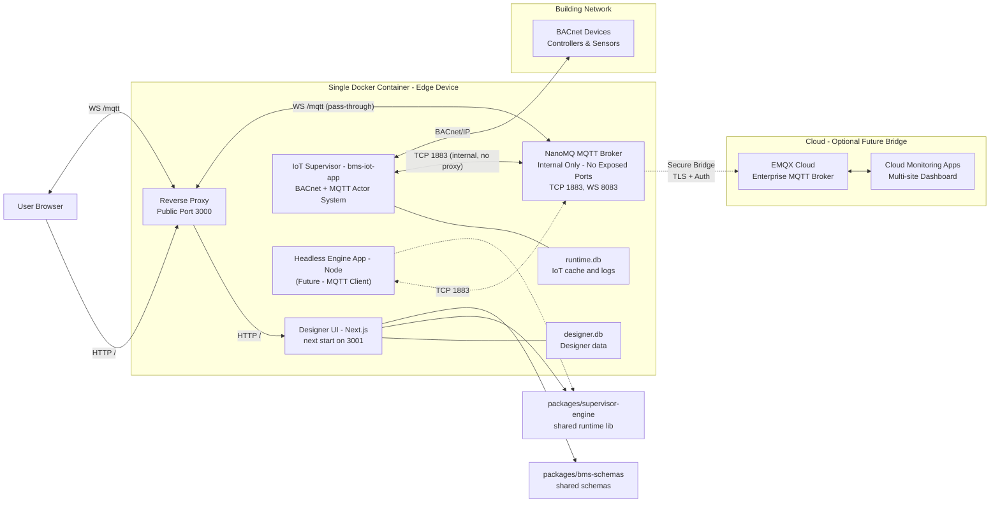
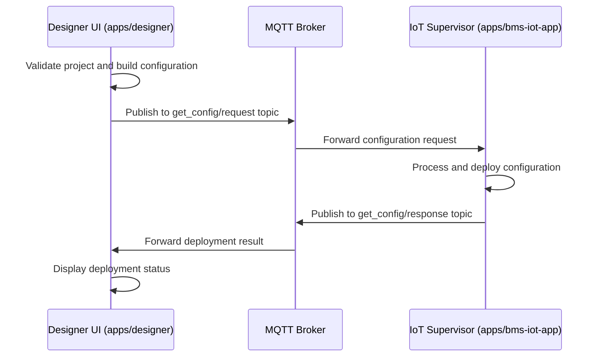
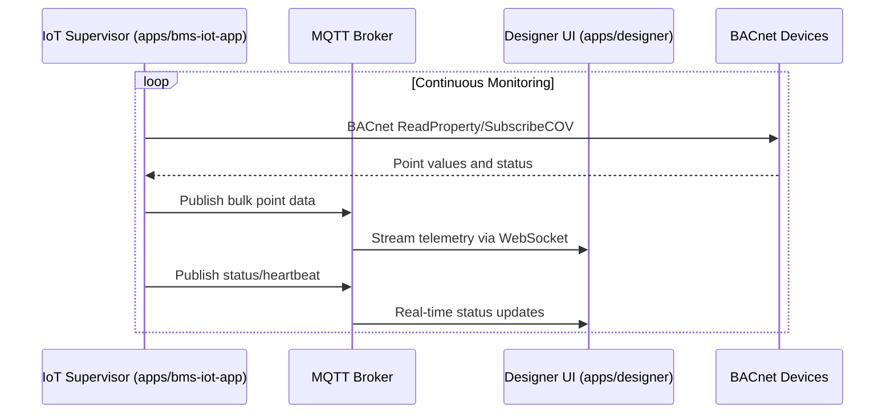
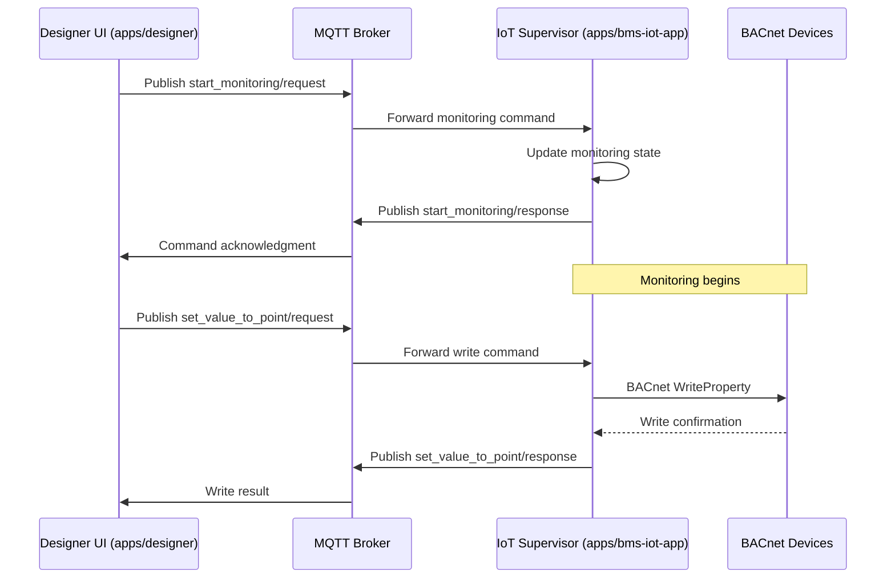
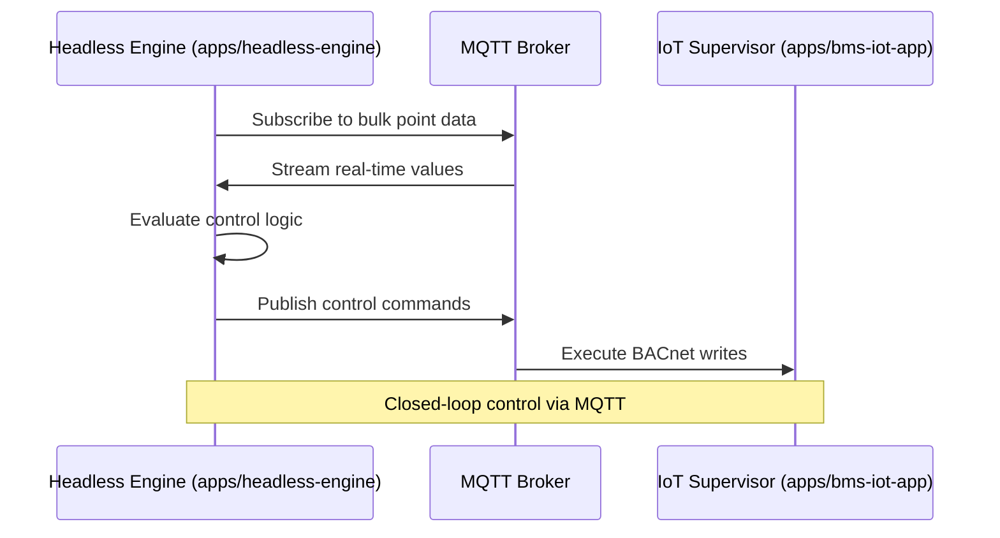

# BMS Supervisor Controller — Architecture

This document captures the target architecture for running the Designer
on-device as the control plane, with a headless execution engine for visual
flows, and a Python FastAPI service providing BACnet access.

Status: Draft (agreed direction)

## Goals

- Single control plane on-device (Designer UI) for projects, validation,
  deployments, and monitoring
- One execution engine (Node) for all visual programming logic — no dual engines
- Python BACnet service (FastAPI + BAC0/bacpypes3) as the sole path to BACnet
  devices
- Offline-first, reliable, low-latency operation on industrial hardware

## High-Level Components

- Designer UI (Next.js) — `apps/designer`

  - Projects, device config, validation, deployments, monitoring UI
  - Local SQLite for dev; Turso/libSQL or equivalent for central storage when needed
  - **MQTT.js client for real-time communication with IoT Supervisor via WebSocket (through reverse proxy on port 3000 → internal broker)**

- MQTT Broker (NanoMQ/Mosquitto) — Local message hub (internal-only)

  - WebSocket support on port 8083 for internal access (browser connects via reverse proxy)
  - TCP/MQTT on port 1883 for IoT devices and services
  - Optional bridge configuration for cloud MQTT connectivity
  - Message persistence, QoS levels, and retained messages

- IoT Supervisor Service (bms-iot-app) — `apps/bms-iot-app` (imported as submodule)

  - **Existing BACnet monitoring and control application**
  - BACnet discovery, read/write, COV subscription management
  - Actor-based architecture with MQTT communication
  - Normalizes units and point metadata
  - Persists runtime cache, short-term logs, and device discovery in local SQLite

- Headless Engine App (Node) — `apps/headless-engine` (planned)

  - Executes validated, versioned runtime bundles generated by Designer UI
  - Schedules, evaluates, and manages runtime state
  - **Communicates with IoT Supervisor via MQTT pub/sub patterns**

- Shared Engine Library — `packages/supervisor-engine` (new)

  - Runtime graph model and node registry
  - Deterministic scheduler (monotonic clock, drift-corrected)
  - Evaluators/expressions, context/state model
  - **MQTT adapter interface for IoT Service communication**
  - Bundle format, versioning, validation helpers

- Shared Schemas — `packages/bms-schemas`

  - Source of truth for configuration and node types (Zod/TS + Pydantic)

## Component Diagram



Legend:

- Reverse Proxy forwards WebSocket frames at `/mqtt` to the internal broker; it does not terminate/understand MQTT.
- bms-iot-app and headless engine use TCP 1883 directly (internal), not via the proxy.

### Packages and Apps

```mermaid
flowchart TB
  subgraph Apps
    A1["apps/designer - UI (Next)"]
    A2["apps/headless-engine - Node service"]
    A3["apps/bms-iot-app - FastAPI"]
  end

  subgraph Packages
    P1["packages/supervisor-engine - engine core"]
    P2["packages/bms-schemas - schemas"]
  end

  A1 --> P1
  A2 --> P1
  A1 <-->|MQTT (primary)| A3
  A2 <-->|MQTT (primary)| A3
  A1 -.->|HTTP (admin-only)| A3
  A2 -.->|HTTP (admin-only)| A3
```

## MQTT Communication Architecture

### Topic Structure (from existing bms-iot-app)

Based on `/Users/amol/Documents/ai-projects/bms-project/packages/shared/mqtt_topics/topics.json`:

```yaml
# Command Topics (Request/Response Pattern)
iot/global/{org_id}/{site_id}/{iot_device_id}/command/get_config/request
iot/global/{org_id}/{site_id}/{iot_device_id}/command/get_config/response
iot/global/{org_id}/{site_id}/{iot_device_id}/command/start_monitoring/request
iot/global/{org_id}/{site_id}/{iot_device_id}/command/start_monitoring/response
iot/global/{org_id}/{site_id}/{iot_device_id}/command/stop_monitoring/request
iot/global/{org_id}/{site_id}/{iot_device_id}/command/stop_monitoring/response
iot/global/{org_id}/{site_id}/{iot_device_id}/command/set_value_to_point/request
iot/global/{org_id}/{site_id}/{iot_device_id}/command/set_value_to_point/response
iot/global/{org_id}/{site_id}/{iot_device_id}/command/reboot/request
iot/global/{org_id}/{site_id}/{iot_device_id}/command/reboot/response

# Status & Telemetry Topics (Publish/Subscribe)
iot/global/{org_id}/{site_id}/{iot_device_id}/status/update     # Health status
iot/global/{org_id}/{site_id}/{iot_device_id}/status/heartbeat  # Periodic heartbeat

# Data Topics
iot/global/{org_id}/{site_id}/{iot_device_id}/bulk              # Bulk point data
iot/global/{org_id}/{site_id}/{iot_device_id}/{controller_id}/{point_id}  # Individual points

# Alert Management
iot/global/{org_id}/{site_id}/alert-management/acknowledge
iot/global/{org_id}/{site_id}/alert-management/resolve
```

### Communication Patterns

1. **Designer UI ↔ IoT Supervisor (Commands)**

   - Designer publishes command requests
   - IoT Supervisor processes and publishes responses
   - Request/Response correlation via message IDs

2. **IoT Supervisor → Designer UI (Telemetry)**

   - Real-time point data streaming via bulk topics
   - Status updates (health, connectivity, monitoring state)
   - Discovery progress and results

3. **Future: Local ↔ Cloud Bridge**
   - Selective forwarding of telemetry to cloud
   - Cloud command routing back to local devices
   - Topic transformation for multi-tenant cloud

### MQTT Broker Configuration

- **Local MQTT Broker**: NanoMQ or Mosquitto (internal-only)
- **WebSocket Port**: 8083 (internal; browser connects via reverse proxy at `/mqtt` on port 3000)
- **TCP Port**: 1883 (for IoT devices and services)
- **QoS Levels**:
  - Commands: QoS 1 (at least once delivery)
  - Telemetry: QoS 0 (best effort) or QoS 1 (critical data)
  - Status: QoS 1 with retained flag
- **Sessions**:
  - Persistent sessions for Engine and IoT Supervisor (clean session: false)
- **Retained messages**:
  - `status/heartbeat` retained, QoS 1; command responses not retained

### Progressive Deployment

1. **Phase 1: Local Only**

   - Single container with internal broker
   - Browser connects to `/mqtt` on port 3000 (reverse proxy) → internal broker

2. **Phase 2: Cloud Bridge (Optional)**
   - Configure MQTT bridge to forward selected topics
   - Cloud monitoring apps connect to cloud MQTT
   - Local operation continues independently

## Roles & Responsibilities

- Designer UI (apps/designer)

  - Authoring: project CRUD, flow editing, node configuration
  - Validation: schema checks (Zod) and static checks using shared code where
    applicable
  - Bundling: compile/serialize flows to a versioned runtime bundle (signed)
  - Deployment: send bundles directly to the Headless Engine; list history and
    support rollback
  - Monitoring: display live execution state and device values from the IoT
    Service
  - Storage: local SQLite for dev (`designer.db`), Turso/libSQL in multi-device
    (Vercel) setups
  - Preview execution: may run flows in-process via `packages/supervisor-engine`
    for editor preview and faster visual feedback; production execution runs in
    the Headless Engine

- Headless Engine (apps/headless-engine)

  - Thin wrapper service: CLI and HTTP API to load/start/stop/reload bundles
  - Lifecycle: persists active bundle version; loads last-good bundle on boot
  - Health and status: liveness/readiness and execution status endpoints;
    structured logs
  - Delegation: all scheduling, evaluation, and I/O orchestration is implemented
    in `packages/supervisor-engine`

- IoT Supervisor Service (apps/bms-iot-app)

  - BACnet operations: discover, read, write, subscribe to COV
  - Device/cache persistence in `runtime.db` (WAL enabled)
  - Normalization (units, metadata) and safety (write interlocks, limits)
  - HTTP API (admin-only) for health, metadata, and diagnostics; primary runtime path is MQTT
  - Localhost-bound by default; LAN exposure optional

- Shared Schemas (packages/bms-schemas) [optional, retained]

  - Central definitions for configuration/node schemas and versions
  - Codegen: Zod/TypeScript for Designer; Pydantic for Python service (where
    applicable)
  - Alternative (future): consolidate config schemas into
    `packages/supervisor-engine`.

- Shared Engine (packages/supervisor-engine)

  - Core runtime engine consumed by both Designer (for validation/preview) and
    Headless Engine (for execution)
  - Deterministic scheduler (monotonic clock, drift correction) and runtime
    state model
  - Node registry and evaluators; expression evaluation utilities
  - I/O adapter interfaces (MQTT primary) and HTTP client (admin-only) for IoT Service (batching,
    debouncing, rate limits)
  - Bundle helpers: versioning, validation, backward-compat checks, optional
    signing

## Engine API Surface (local-only by default)

- HTTP endpoints (served by `apps/headless-engine`):
  - POST `/engine/deploy` → deploy a versioned bundle { bundle, version }
  - POST `/engine/reload` → reload active bundle (no change)
  - POST `/engine/start` / `/engine/stop` → control execution
  - GET `/engine/status` → version, active flows, scheduler state
  - GET `/engine/health` → liveness/readiness
  - GET `/engine/stream` (SSE/WS) → execution metrics/events
- Auth: bind to localhost; optional token/mTLS for hardened setups

### Engine CLI (wrapping `packages/supervisor-engine`)

- `headless-engine start`
- `headless-engine deploy <bundle.json>`
- `headless-engine status`
- `headless-engine stop`

## Key Data Flows

Note: Browser MQTT-over-WebSocket connections traverse the reverse proxy at `/mqtt` (port 3000) to reach the internal broker; for brevity, the diagrams show UI ↔ MQTT directly.

### 1) Configuration Deployment (Designer UI → IoT Supervisor)



### 2) BACnet Monitoring (IoT Supervisor → Designer UI)



### 3) Command & Control (Designer UI → IoT Supervisor)



### 4) Future: Engine Integration (Headless Engine → IoT Supervisor)



## Deployment & Process Model

### Single Container Deployment

- **Single Docker Container**:

  - Reverse Proxy on port 3000 (only exposed port): routes `/` to Next (3001) and `/mqtt` (WS) to NanoMQ (8083)
  - Designer UI (Next.js) served by `next start` on port 3001 (internal)
  - IoT Supervisor (bms-iot-app) - BACnet monitoring and MQTT communication
  - NanoMQ MQTT Broker - completely internal (no exposed ports)
  - Headless Engine (planned) - Flow execution via internal MQTT

- **Process Management**: Supervisord manages all processes within container
- **Internal Communication**: All MQTT communication via localhost (no external network exposure)
- **Persistence**: Container volumes for SQLite databases and MQTT data
- **Security**: Minimal attack surface with single exposed port (reverse proxy)

### Example Single Container Structure

```dockerfile
FROM node:20-bullseye AS designer-build
WORKDIR /app
COPY apps/designer/package*.json ./
RUN npm ci
COPY apps/designer .
RUN npm run build

FROM node:20-bullseye
ENV DEBIAN_FRONTEND=noninteractive
RUN apt-get update && apt-get install -y \
    supervisor \
    nginx \
    python3 \
    python3-pip \
    wget \
  && rm -rf /var/lib/apt/lists/*

# Install NanoMQ (internal broker)
RUN wget -O /tmp/nanomq.tar.gz \
    https://github.com/nanomq/nanomq/releases/latest/download/nanomq-0.21.0-linux-x86_64.tar.gz \
    && tar -xzf /tmp/nanomq.tar.gz -C /usr/local/bin --strip-components=1 \
    && rm /tmp/nanomq.tar.gz

# Install IoT Supervisor
WORKDIR /iot-app
COPY apps/bms-iot-app/requirements.txt .
RUN pip install --no-cache-dir -r requirements.txt
COPY apps/bms-iot-app .

# Copy Designer app (run with `next start`)
WORKDIR /designer
COPY --from=designer-build /app .

# Configure services
COPY config/supervisord.conf /etc/supervisor/conf.d/
COPY config/nanomq.conf /etc/nanomq.conf
COPY config/nginx.conf /etc/nginx/nginx.conf

EXPOSE 3000
CMD ["/usr/bin/supervisord", "-c", "/etc/supervisor/supervisord.conf"]
```

### Supervisord Configuration

```ini
[supervisord]
nodaemon=true
user=root

[program:nanomq]
command=/usr/local/bin/nanomq start --conf /etc/nanomq.conf
autostart=true
autorestart=true
priority=100

[program:iot-supervisor]
command=python3 -m src.main
directory=/iot-app
autostart=true
autorestart=true
priority=200

[program:designer]
command=npm run start -- -p 3001
directory=/designer
autostart=true
autorestart=true
priority=300

[program:reverse-proxy]
command=/usr/sbin/nginx -g 'daemon off;'
autostart=true
autorestart=true
priority=400
```

### Reverse Proxy Routing

- Public port `3000` terminates HTTP and WS connections:
  - `/` → Next.js on `localhost:3001`
  - `/mqtt` (WebSocket) → NanoMQ on `localhost:8083`
- Configure WS upgrade headers, idle timeouts suitable for MQTT-over-WS, and allowed origins.

Example `nginx.conf` (abridged for documentation):

```nginx
events {}
http {
  map $http_upgrade $connection_upgrade { default upgrade; '' close; }
  server {
    listen 3000;

    location / {
      proxy_pass http://127.0.0.1:3001;
      proxy_set_header Host $host;
      proxy_set_header X-Forwarded-Proto $scheme;
    }

    location /mqtt {
      proxy_http_version 1.1;
      proxy_set_header Upgrade $http_upgrade;
      proxy_set_header Connection $connection_upgrade;
      proxy_set_header Host $host;
      proxy_pass http://127.0.0.1:8083;
      proxy_read_timeout 3600s;
      proxy_send_timeout 3600s;
    }
  }
}
```

### Pros & Cons of Separate Engine App

- Pros: isolation from Next.js lifecycle, simpler restarts, clearer boundaries,
  easier packaging
- Cons: one more process to supervise; minor packaging overhead — mitigated by
  supervision and clean contracts

## Storage

- Designer data: `designer.db` (SQLite local) or Turso/libSQL; project metadata,
  deployments, device configuration
- IoT runtime data: `runtime.db` (SQLite, WAL) for discovery cache, last values,
  short-term logs
- Separation prevents cross-process contention and clarifies ownership

### Storage Ownership

- designer.db — Owned by Designer UI (apps/designer)

  - Contents: projects, versions/deployments, device registry, UI settings
  - Access: Designer read/write; Engine and IoT Service do not access this DB directly

- runtime.db — Owned by IoT Service (apps/bms-iot-app)

  - Contents: device discovery/cache, COV subscription state, last/aggregated values, short-term telemetry/logs, BACnet metadata
  - Access: IoT Service is the sole writer; Designer and Engine read runtime data via IoT Service APIs (HTTP/WS), not via direct DB access

- Engine state — Owned by Headless Engine (apps/headless-engine)
  - Contents: active and last-good bundles, scheduler metadata (e.g., last run timestamps), engine logs
  - Storage: filesystem-based, immutable bundles with atomic symlink switching (no engine.db). Engine does not write to runtime.db

### Engine Bundle Storage (files, not DB)

- Directory layout (example):

```
/var/lib/headless-engine/
  bundles/
    2025-09-12T12-33-01Z-abc123/
      bundle.json
      manifest.json   # version, schemaVersion, hash/signature, createdBy
    2025-09-10T09-00-00Z-def456/
      bundle.json
      manifest.json
  active -> bundles/2025-09-12T12-33-01Z-abc123  # symlink
  last_good -> bundles/2025-09-10T09-00-00Z-def456 # symlink
  state.json           # optional: last run timestamps, counters
  logs/                # structured logs
```

- Atomic deploy flow:

  - Write to `bundles/.staging/<version>/bundle.json` and `manifest.json`, fsync
  - Rename `.staging/<version>` → `bundles/<version>` atomically
  - Update `active` symlink atomically; keep `last_good` pointing to previous
  - Trigger reload; on failure, revert `active` to `last_good`

- Rollback:
  - Switch `active` to a previous version (via CLI or control API), keep retention of last N versions

## Testing Strategy

- packages/supervisor-engine
  - Unit: scheduler, node evaluators, graph validation
  - Integration: HTTP adapter against a mocked IoT Service
  - Soak: long-running timing and backoff tests
- apps/headless-engine
  - E2E with real IoT Service (or simulator): deploy, execute, recover
- apps/bms-iot-app
  - API contract tests; BACnet simulator-backed tests for read/write/COV

## Security Considerations

### Single Container Architecture

**Current: Local-Only Deployment**

```
                User (Browser)
                      |
                      v
┌─────────────────────────────────────────┐
│      Single Docker Container (Edge)     │
│                                         │
│  ┌────────────────────────────────────┐ │
│  │        Reverse Proxy (3000)       │ │
│  │                                    │ │
│  │  ├─ HTTP /  ─────────▶ Next.js     │ │
│  │  │                        (3001)   │ │
│  │  └─ WS /mqtt ─────────▶ NanoMQ WS  │ │
│  │                           (8083)   │ │
│  └────────────────────────────────────┘ │
│                                         │
│  ┌───────────────┐     ┌────────────────┐│
│  │ bms-iot-app   │────▶│ NanoMQ Broker  ││
│  │  (FastAPI)    │ TCP │ (1883, 8083)   ││
│  └───────────────┘     └────────────────┘│
│                                         │
│  Notes:                                  │
│  - Reverse Proxy forwards WS at /mqtt to NanoMQ (8083). │
│  - bms-iot-app connects directly to NanoMQ via TCP 1883.│
│  - User loads the React UI (Next.js serves on 3001) via the proxy. │
│                                         │
│  Port 3000: Reverse proxy (only exposed)│
└─────────────────────────────────────────┘
```

Browser paths:

- HTTP UI: User → Reverse Proxy (`/`) → Designer (Next on 3001)
- MQTT WS: User → Reverse Proxy (`/mqtt`) → NanoMQ (internal WS 8083)

Internal paths:

- Reverse Proxy `/mqtt` → NanoMQ (WS pass-through; no MQTT termination)
- bms-iot-app → NanoMQ (TCP 1883, internal)

**Future: Cloud-Connected**

```
┌─────────────────────────────────────────┐
│      Single Docker Container (Edge)     │
│                                         │
│  ┌──────────────┐   ┌───────────────┐  │
│  │  Designer    │   │ IoT Supervisor│  │
│  └──────┬───────┘   └────┬──────────┘  │
│         ↓                 ↓             │
│  ┌────────────────────────────────┐    │
│  │   NanoMQ (Local MQTT Broker)   │    │
│  └────────────────┬───────────────┘    │
│                   │                     │
└───────────────────┼─────────────────────┘
                    ↕ Bridge (Bidirectional)
                    ↕ TLS + Auth
            ┌───────────────────┐
            │   EMQX Cloud      │
            └─────────┬─────────┘
                      ↕
            Cloud Monitoring Apps
```

### Security Benefits

1. **Minimal Attack Surface**

   - Only port 3000 exposed (reverse proxy to Next and WS to broker)
   - MQTT broker completely internal (no external ports; WS only via proxy)
   - No inter-container network to secure
   - Single security boundary to defend

2. **Defense in Depth**

   - All MQTT communication internal to container
   - No network-based attacks between components
   - Future cloud connectivity via secure MQTT bridge
   - EMQX Cloud provides enterprise security features

3. **Operational Security**
   - Single container to patch and update
   - Unified logging and monitoring
   - Simple backup and disaster recovery
   - Perfect for air-gapped deployments

## Security

- IoT Service binds to localhost by default; LAN exposure optional
- Engine↔Service tokens (short-lived) or mTLS (configurable)
- Write interlocks and rate limits on BACnet writes
- Signed runtime bundles; version pinning and rollback

## Non-Goals

- No second executor in Python; one engine (Node) defines flow semantics
- Designer UI and Headless Engine do not speak BACnet directly — all BACnet operations go through the IoT Service (FastAPI) API

## Extensibility

- Add protocol plugins behind the IoT Service (e.g., Modbus) — consistent API to
  Engine
- Optional streaming via MQTT/NATS for higher-frequency telemetry (HTTP remains
  fallback)
- Future: compiled hot paths or native addons for numeric-heavy transforms

## Mapping to Repository

- `apps/designer`

  - Next.js app (UI)
  - Local/remote DB support: better-sqlite3 (local), Turso/libSQL (remote)
  - API routes for project CRUD and proxying (if needed)

- `apps/headless-engine` (planned)

  - Node process hosting the Engine API; wraps `packages/supervisor-engine`
  - Provides CLI + HTTP endpoints; local-only by default

- `apps/bms-iot-app`

  - FastAPI application exposing BACnet operations and health
  - BAC0/bacpypes3 integration (planned/ongoing)

- `packages/bms-schemas`

  - Zod schemas and generated types for Designer
  - Pydantic models for Python (optional usage)

- `packages/supervisor-engine` (new)

  - Shared engine library (scheduler, graph, adapters, validators)
  - Consumed by Designer (for validation) and headless engine app (for
    execution)

Engine code lives alongside Designer as a separate process and will be
introduced incrementally; this doc defines its role and interfaces up front.
