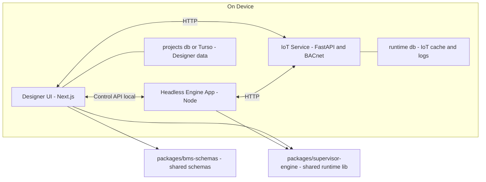
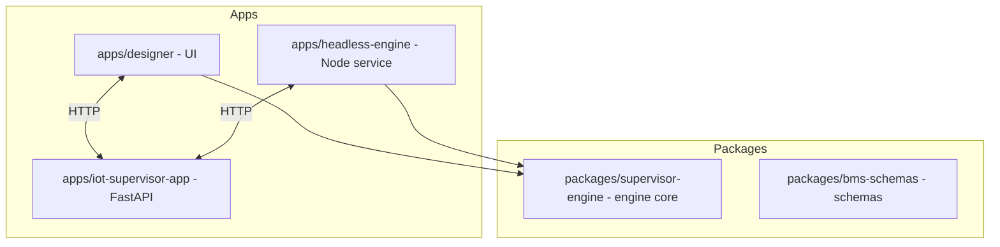
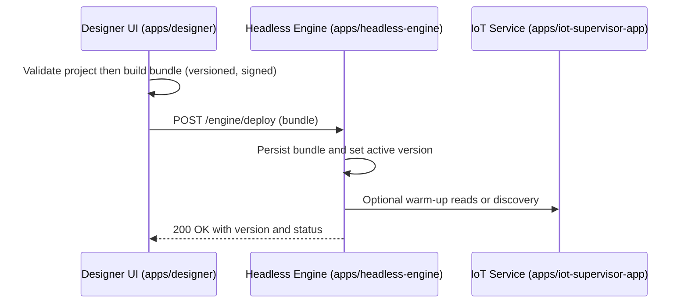
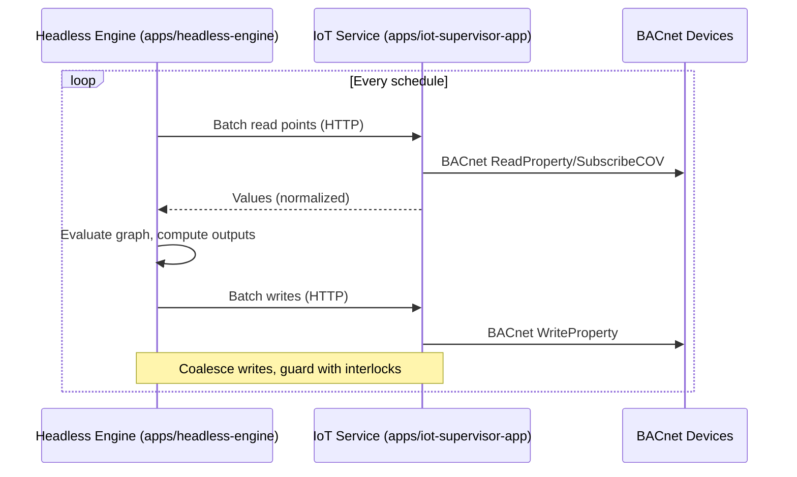

# BMS Supervisor Controller — Architecture

This document captures the target architecture for running the Designer
on-device as the control plane, with a headless execution engine for visual
flows, and a Python FastAPI service providing BACnet access.

Status: Draft (agreed direction)

## Goals

- Single control plane on-device (Designer UI) for projects, validation,
  deployments, and monitoring
- One execution engine (Node) for all visual programming logic — no dual engines
- Python BACnet service (FastAPI + BAC0/bacpypes3) as the sole path to BACnet
  devices
- Offline-first, reliable, low-latency operation on industrial hardware

## High-Level Components

- Designer UI (Next.js) — `apps/designer`

  - Projects, device config, validation, deployments, monitoring UI
  - Local SQLite for dev; Turso/libSQL or equivalent for central storage when
    needed

- Headless Engine App (Node) — `apps/headless-engine` (planned)

  - Executes validated, versioned runtime bundles generated by Designer UI
  - Schedules, evaluates, and manages runtime state
  - Communicates with IoT Service over localhost HTTP/SSE/WebSocket

- Shared Engine Library — `packages/supervisor-engine` (new)

  - Runtime graph model and node registry
  - Deterministic scheduler (monotonic clock, drift-corrected)
  - Evaluators/expressions, context/state model
  - I/O adapter interface + HTTP client for IoT Service
  - Bundle format, versioning, validation helpers

- IoT Supervisor Service (FastAPI + Python) — `apps/iot-supervisor-app`

  - BACnet discovery, read/write, COV subscription management
  - Normalizes units and point metadata
  - Persists runtime cache, short-term logs, and device discovery in local
    SQLite (`runtime.db`)

- Shared Schemas — `packages/bms-schemas`

  - Source of truth for configuration and node types (Zod/TS + Pydantic)

## Component Diagram



### Packages and Apps



## Roles & Responsibilities

- Designer UI (apps/designer)

  - Authoring: project CRUD, flow editing, node configuration
  - Validation: schema checks (Zod) and static checks using shared code where
    applicable
  - Bundling: compile/serialize flows to a versioned runtime bundle (signed)
  - Deployment: send bundles directly to the Headless Engine; list history and
    support rollback
  - Monitoring: display live execution state and device values from the IoT
    Service
  - Storage: local SQLite for dev (`designer.db`), Turso/libSQL in multi-device
    (Vercel) setups
  - Preview execution: may run flows in-process via `packages/supervisor-engine`
    for editor preview and faster visual feedback; production execution runs in
    the Headless Engine

- Headless Engine (apps/headless-engine)

  - Thin wrapper service: CLI and HTTP API to load/start/stop/reload bundles
  - Lifecycle: persists active bundle version; loads last-good bundle on boot
  - Health and status: liveness/readiness and execution status endpoints;
    structured logs
  - Delegation: all scheduling, evaluation, and I/O orchestration is implemented
    in `packages/supervisor-engine`

- IoT Supervisor Service (apps/iot-supervisor-app)

  - BACnet operations: discover, read, write, subscribe to COV
  - Device/cache persistence in `runtime.db` (WAL enabled)
  - Normalization (units, metadata) and safety (write interlocks, limits)
  - Streaming endpoint (SSE/WebSocket) for live values; HTTP API as fallback
  - Localhost-bound by default; LAN exposure optional

- Shared Schemas (packages/bms-schemas) [optional, retained]

  - Central definitions for configuration/node schemas and versions
  - Codegen: Zod/TypeScript for Designer; Pydantic for Python service (where
    applicable)
  - Alternative (future): consolidate config schemas into
    `packages/supervisor-engine`.

- Shared Engine (packages/supervisor-engine)

  - Core runtime engine consumed by both Designer (for validation/preview) and
    Headless Engine (for execution)
  - Deterministic scheduler (monotonic clock, drift correction) and runtime
    state model
  - Node registry and evaluators; expression evaluation utilities
  - I/O adapter interfaces and HTTP client for IoT Service (batching,
    debouncing, rate limits)
  - Bundle helpers: versioning, validation, backward-compat checks, optional
    signing

## Engine API Surface (local-only by default)

- HTTP endpoints (served by `apps/headless-engine`):
  - POST `/engine/deploy` → deploy a versioned bundle { bundle, version }
  - POST `/engine/reload` → reload active bundle (no change)
  - POST `/engine/start` / `/engine/stop` → control execution
  - GET `/engine/status` → version, active flows, scheduler state
  - GET `/engine/health` → liveness/readiness
  - GET `/engine/stream` (SSE/WS) → execution metrics/events
- Auth: bind to localhost; optional token/mTLS for hardened setups

### Engine CLI (wrapping `packages/supervisor-engine`)

- `headless-engine start`
- `headless-engine deploy <bundle.json>`
- `headless-engine status`
- `headless-engine stop`

## Key Data Flows

### 1) Deploy-Time (Designer UI → Headless Engine)



### 2) Runtime Tick (Headless Engine → IoT Service → BACnet)



### 3) Monitoring (Designer UI ↔ IoT Service)

- Designer UI (apps/designer) subscribes to live value streams from IoT Service
  (apps/iot-supervisor-app) via SSE/WebSocket (preferred) or polls HTTP
  endpoints.
- Designer UI displays execution state (per-flow, per-node metrics) surfaced by
  the Headless Engine (apps/headless-engine).

## Deployment & Process Model

- Processes/containers on-device:
  - `designer-ui` (Next.js, port 3000)
  - `designer-engine` (Node worker, long-lived)
  - `iot-service` (FastAPI, port 8080)
- Startup order: iot-service → designer-engine → designer-ui
- Supervision: systemd or docker-compose/Balena; restart on failure;
  health/readiness checks

### Pros & Cons of Separate Engine App

- Pros: isolation from Next.js lifecycle, simpler restarts, clearer boundaries,
  easier packaging
- Cons: one more process to supervise; minor packaging overhead — mitigated by
  supervision and clean contracts

## Storage

- Designer data: `projects.db` (SQLite local) or Turso/libSQL; project metadata,
  deployments, device configuration
- IoT runtime data: `runtime.db` (SQLite, WAL) for discovery cache, last values,
  short-term logs
- Separation prevents cross-process contention and clarifies ownership

### Storage Ownership

- designer.db — Owned by Designer UI (apps/designer)

  - Contents: projects, versions/deployments, device registry, UI settings
  - Access: Designer read/write; Engine and IoT Service do not access this DB directly

- runtime.db — Owned by IoT Service (apps/iot-supervisor-app)

  - Contents: device discovery/cache, COV subscription state, last/aggregated values, short-term telemetry/logs, BACnet metadata
  - Access: IoT Service is the sole writer; Designer and Engine read runtime data via IoT Service APIs (HTTP/WS), not via direct DB access

- Engine state — Owned by Headless Engine (apps/headless-engine)
  - Contents: active and last-good bundles, scheduler metadata (e.g., last run timestamps), engine logs
  - Storage: filesystem-based, immutable bundles with atomic symlink switching (no engine.db). Engine does not write to runtime.db

### Engine Bundle Storage (files, not DB)

- Directory layout (example):

```
/var/lib/headless-engine/
  bundles/
    2025-09-12T12-33-01Z-abc123/
      bundle.json
      manifest.json   # version, schemaVersion, hash/signature, createdBy
    2025-09-10T09-00-00Z-def456/
      bundle.json
      manifest.json
  active -> bundles/2025-09-12T12-33-01Z-abc123  # symlink
  last_good -> bundles/2025-09-10T09-00-00Z-def456 # symlink
  state.json           # optional: last run timestamps, counters
  logs/                # structured logs
```

- Atomic deploy flow:

  - Write to `bundles/.staging/<version>/bundle.json` and `manifest.json`, fsync
  - Rename `.staging/<version>` → `bundles/<version>` atomically
  - Update `active` symlink atomically; keep `last_good` pointing to previous
  - Trigger reload; on failure, revert `active` to `last_good`

- Rollback:
  - Switch `active` to a previous version (via CLI or control API), keep retention of last N versions

## Testing Strategy

- packages/supervisor-engine
  - Unit: scheduler, node evaluators, graph validation
  - Integration: HTTP adapter against a mocked IoT Service
  - Soak: long-running timing and backoff tests
- apps/headless-engine
  - E2E with real IoT Service (or simulator): deploy, execute, recover
- apps/iot-supervisor-app
  - API contract tests; BACnet simulator-backed tests for read/write/COV

## Security

- IoT Service binds to localhost by default; LAN exposure optional
- Engine↔Service tokens (short-lived) or mTLS (configurable)
- Write interlocks and rate limits on BACnet writes
- Signed runtime bundles; version pinning and rollback

## Non-Goals

- No second executor in Python; one engine (Node) defines flow semantics
- Designer UI and Headless Engine do not speak BACnet directly — all BACnet operations go through the IoT Service (FastAPI) API

## Extensibility

- Add protocol plugins behind the IoT Service (e.g., Modbus) — consistent API to
  Engine
- Optional streaming via MQTT/NATS for higher-frequency telemetry (HTTP remains
  fallback)
- Future: compiled hot paths or native addons for numeric-heavy transforms

## Mapping to Repository

- `apps/designer`

  - Next.js app (UI)
  - Local/remote DB support: better-sqlite3 (local), Turso/libSQL (remote)
  - API routes for project CRUD and proxying (if needed)

- `apps/headless-engine` (planned)

  - Node process hosting the Engine API; wraps `packages/supervisor-engine`
  - Provides CLI + HTTP endpoints; local-only by default

- `apps/iot-supervisor-app`

  - FastAPI application exposing BACnet operations and health
  - BAC0/bacpypes3 integration (planned/ongoing)

- `packages/bms-schemas`

  - Zod schemas and generated types for Designer
  - Pydantic models for Python (optional usage)

- `packages/supervisor-engine` (new)

  - Shared engine library (scheduler, graph, adapters, validators)
  - Consumed by Designer (for validation) and headless engine app (for
    execution)

Engine code lives alongside Designer as a separate process and will be
introduced incrementally; this doc defines its role and interfaces up front.
