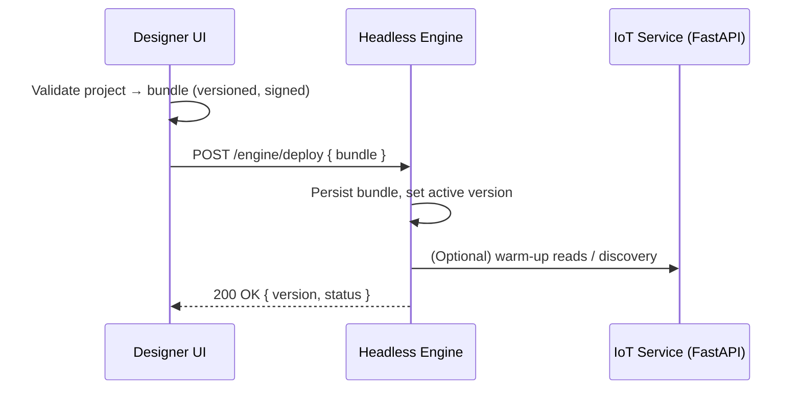
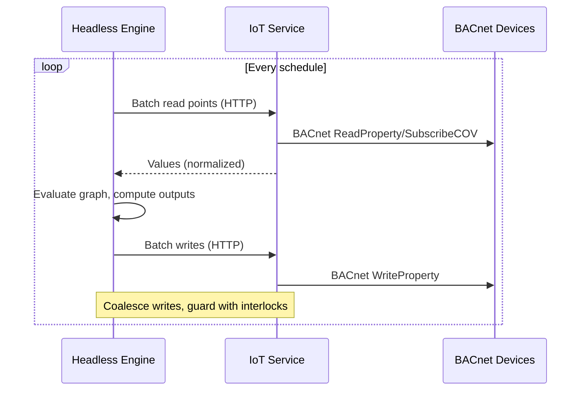

# BMS Supervisor Controller — Architecture

This document captures the target architecture for running the Designer on-device as the control plane, with a headless execution engine for visual flows, and a Python FastAPI service providing BACnet access.

Status: Draft (agreed direction)

## Goals

- Single control plane on-device (Designer UI) for projects, validation, deployments, and monitoring
- One execution engine (Node) for all visual programming logic — no dual engines
- Python BACnet service (FastAPI + BAC0/bacpypes3) as the sole path to BACnet devices
- Offline-first, reliable, low-latency operation on industrial hardware

## High-Level Components

- Designer UI (Next.js) — `apps/designer`

  - Projects, device config, validation, deployments, monitoring UI
  - Local SQLite for dev; Turso/libSQL or equivalent for central storage when needed

- Headless Engine App (Node) — `apps/headless-engine` (planned)

  - Executes validated, versioned runtime bundles generated by Designer UI
  - Schedules, evaluates, and manages runtime state
  - Communicates with IoT Service over localhost HTTP/SSE/WebSocket

- Shared Engine Library — `packages/supervisor-engine` (new)

  - Runtime graph model and node registry
  - Deterministic scheduler (monotonic clock, drift-corrected)
  - Evaluators/expressions, context/state model
  - I/O adapter interface + HTTP client for IoT Service
  - Bundle format, versioning, validation helpers

- IoT Supervisor Service (FastAPI + Python) — `apps/iot-supervisor-app`

  - BACnet discovery, read/write, COV subscription management
  - Normalizes units and point metadata
  - Persists runtime cache, short-term logs, and device discovery in local SQLite (`runtime.db`)

- Shared Schemas — `packages/bms-schemas`
  - Source of truth for configuration and node types (Zod/TS + Pydantic)

## Component Diagram

```mermaid
flowchart LR
  subgraph Device[On-Device]
    UI[Designer UI (Next.js)\napps/designer :3000]
    Engine[Headless Engine App (Node)\nflow executor]
    PY[IoT Supervisor Service (FastAPI)\nPython + BAC0/bacpypes3 :8080]

    DB1[(projects.db\nDesigner/Turso)]
    DB2[(runtime.db\nIoT cache/logs)]

    UI -->|deploy bundle| Engine
    Engine <--> |read/write, discover, COV| PY
    UI -.-> |monitor via API/stream| PY

    UI --- DB1
    PY --- DB2
  end

  PY --> |BACnet/IP| BACNET[(BACnet Devices)]
```

### Packages and Apps

```mermaid
flowchart TB
  subgraph Apps
    A1[apps/designer\nNext.js UI]
    A2[apps/headless-engine\nNode service]
    A3[apps/iot-supervisor-app\nFastAPI + BACnet]
  end

  subgraph Packages
    P1[packages/supervisor-engine\nshared runtime library]
    P2[packages/bms-schemas\nshared schemas (optional, retained)]
  end

  A1 -->|deploy bundle| A2
  A2 <--> |HTTP/WS| A3
  A1 --> P2
  A2 --> P1
```

## Roles & Responsibilities

- Designer UI (apps/designer)

  - Authoring: project CRUD, flow editing, node configuration
  - Validation: schema checks against `bms-schemas`
  - Bundling: compile/serialize flows to a versioned runtime bundle (signed)
  - Deployment: send bundles to the local Engine; list history and support rollback
  - Monitoring: display live execution state and device values from the IoT Service
  - Storage: local SQLite for dev (`designer.db`), Turso/libSQL in multi-device setups

- Headless Engine (apps/headless-engine) [Not created]

  - Single runtime for executing flow logic (interpreted pipeline initially)
  - Deterministic scheduling (drift-corrected timers, persisted last-run)
  - State management (context, retries, error handling)
  - I/O adapter to IoT Service (batching, debouncing, rate-limits, COV-first)
  - Health endpoints and structured logs; loads last-good bundle on boot

- IoT Supervisor Service (apps/iot-supervisor-app)

  - BACnet operations: discover, read, write, subscribe to COV
  - Device/cache persistence in `runtime.db` (WAL enabled)
  - Normalization (units, metadata) and safety (write interlocks, limits)
  - Streaming endpoint (SSE/WebSocket) for live values; HTTP API as fallback
  - Localhost-bound by default; LAN exposure optional

- Shared Schemas (packages/bms-schemas) [optional, retained]

  - Central definitions for configuration/node schemas and versions
  - Codegen: Zod/TypeScript for Designer; Pydantic for Python service (where applicable)
  - Alternative (future): move config schemas into `packages/supervisor-engine` and generate Python models from an OpenAPI spec; choose a single source of truth to avoid drift

- Shared Engine (packages/supervisor-engine) [Requires refactoring from apps/designer app]
  - Shared code between Headless Engine and Designer.
  - Visual programing model data.

## Engine API Surface (local-only by default)

- HTTP endpoints (served by `apps/headless-engine`):
  - POST `/engine/deploy` → deploy a versioned bundle { bundle, version }
  - POST `/engine/reload` → reload active bundle (no change)
  - POST `/engine/start` / `/engine/stop` → control execution
  - GET `/engine/status` → version, active flows, scheduler state
  - GET `/engine/health` → liveness/readiness
  - GET `/engine/stream` (SSE/WS) → execution metrics/events
- Auth: bind to localhost; optional token/mTLS for hardened setups

### Engine CLI (wrapping `packages/supervisor-engine`)

- `headless-engine start`
- `headless-engine deploy <bundle.json>`
- `headless-engine status`
- `headless-engine stop`

## Runtime Bundle Format & Versioning

- Top-level fields:
  - `version` (semantic), `schemaVersion`, `createdAt`, `createdBy`
  - `nodeTypes` (declared), `graph` (nodes, edges), `schedules`
  - `defaults` (params), `constraints` (limits/interlocks)
  - `signature` (optional, for tamper detection)
- Validation pipeline:
  1. Zod (Designer) → static checks
  2. Engine validators → runtime-specific checks (e.g., cycles, rate limits)
  3. Backward-compat checks on deploy (schema versions)

## Key Data Flows

### 1) Deploy-Time (Designer → Engine)



### 2) Runtime Tick (Engine → IoT Service → BACnet)



### 3) Monitoring (UI ↔ IoT Service)

- UI subscribes to live value streams from IoT Service via SSE/WebSocket (preferred) or polls HTTP endpoints.
- UI displays execution state (per-flow, per-node metrics) surfaced by the Engine.

## Deployment & Process Model

- Processes/containers on-device:
  - `designer-ui` (Next.js, port 3000)
  - `designer-engine` (Node worker, long-lived)
  - `iot-service` (FastAPI, port 8080)
- Startup order: iot-service → designer-engine → designer-ui
- Supervision: systemd or docker-compose/Balena; restart on failure; health/readiness checks

### Pros & Cons of Separate Engine App

- Pros: isolation from Next.js lifecycle, simpler restarts, clearer boundaries, easier packaging
- Cons: one more process to supervise; minor packaging overhead — mitigated by supervision and clean contracts

## Storage

- Designer data: `projects.db` (SQLite local) or Turso/libSQL; project metadata, deployments, device configuration
- IoT runtime data: `runtime.db` (SQLite, WAL) for discovery cache, last values, short-term logs
- Separation prevents cross-process contention and clarifies ownership

## Testing Strategy

- packages/supervisor-engine
  - Unit: scheduler, node evaluators, graph validation
  - Integration: HTTP adapter against a mocked IoT Service
  - Soak: long-running timing and backoff tests
- apps/headless-engine
  - E2E with real IoT Service (or simulator): deploy, execute, recover
- apps/iot-supervisor-app
  - API contract tests; BACnet simulator-backed tests for read/write/COV

## Security

- IoT Service binds to localhost by default; LAN exposure optional
- Engine↔Service tokens (short-lived) or mTLS (configurable)
- Write interlocks and rate limits on BACnet writes
- Signed runtime bundles; version pinning and rollback

## Non-Goals

- No second executor in Python; one engine (Node) defines flow semantics
- Designer does not talk to BACnet directly

## Extensibility

- Add protocol plugins behind the IoT Service (e.g., Modbus) — consistent API to Engine
- Optional streaming via MQTT/NATS for higher-frequency telemetry (HTTP remains fallback)
- Future: compiled hot paths or native addons for numeric-heavy transforms

## Mapping to Repository

- `apps/designer`

  - Next.js app (UI)
  - Local/remote DB support: better-sqlite3 (local), Turso/libSQL (remote)
  - API routes for project CRUD and proxying (if needed)

- `apps/headless-engine` (planned)

  - Node process hosting the Engine API; wraps `packages/supervisor-engine`
  - Provides CLI + HTTP endpoints; local-only by default

- `apps/iot-supervisor-app`

  - FastAPI application exposing BACnet operations and health
  - BAC0/bacpypes3 integration (planned/ongoing)

- `packages/bms-schemas`

  - Zod schemas and generated types for Designer
  - Pydantic models for Python (optional usage)

- `packages/supervisor-engine` (new)
  - Shared engine library (scheduler, graph, adapters, validators)
  - Consumed by Designer (for validation) and headless engine app (for execution)

Engine code lives alongside Designer as a separate process and will be introduced incrementally; this doc defines its role and interfaces up front.
