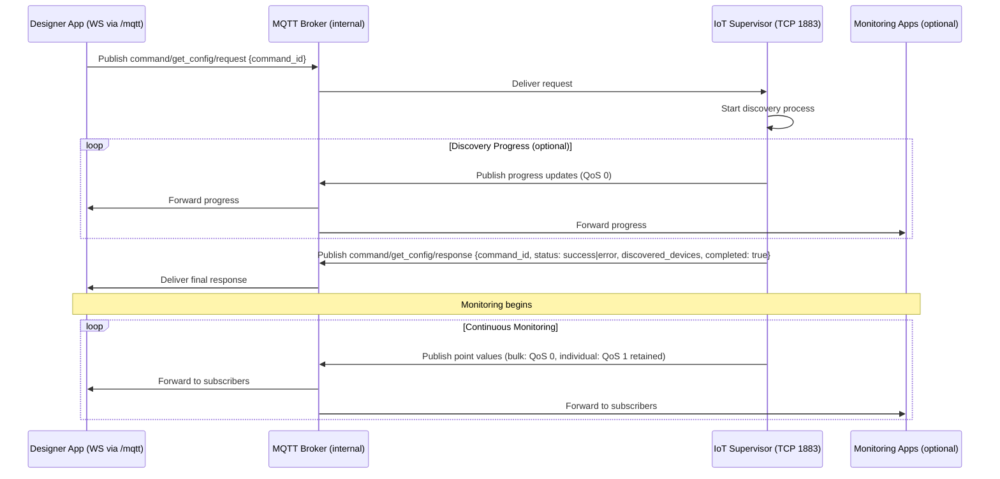
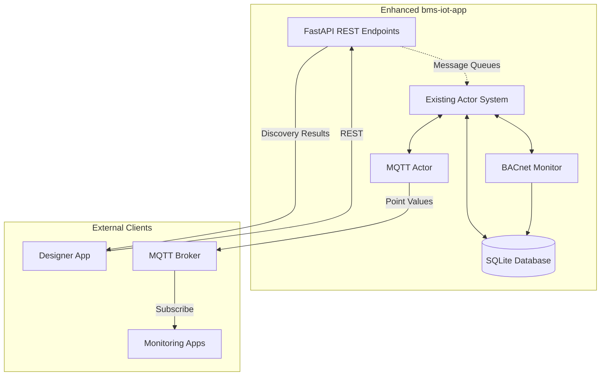

# Phase 7: Pure MQTT BACnet Discovery & Monitoring

**Created**: September 21, 2025
**Version**: 1.0
**Authors**: Development Team

## 1. Executive Summary

### 1.1 Purpose

Phase 7 implements a pure MQTT communication architecture using request/response patterns for commands and pub/sub patterns for real-time telemetry streaming. This phase integrates the existing `bms-iot-app` with the Designer app through an internal MQTT broker inside a single container. The browser connects via WebSocket to the reverse proxy on port 3000 at `/mqtt`, which forwards to the internal broker, while services use TCP 1883 internally. Cloud connectivity remains possible via MQTT bridging.

### 1.2 Key Objectives

- **Pure MQTT Architecture**: Single protocol for all runtime communication using WebSocket (browser) and TCP (services)
- **Repository Integration**: Extract and integrate existing `bms-iot-app` as public submodule
- **Browser-to-IoT via Reverse Proxy**: WebSocket connection from Designer browser to reverse proxy (`/mqtt` on port 3000) that forwards to internal MQTT broker
- **Existing Code Reuse**: Leverage all proven BACnet functionality and existing MQTT topics
- **Progressive Deployment**: Local-first with optional cloud bridge for multi-site monitoring
- **Device Identity Management**: Automatic generation of org_id/site_id/iot_device_id hierarchy

### 1.3 Success Criteria

- Designer app connects directly to local MQTT broker via WebSocket
- BACnet discovery works via get_config command request/response pattern
- Real-time point values stream via MQTT bulk data topics
- Device identity (org_id/site_id/iot_device_id) automatically generated and configured
- Live values display in Designer BACnet nodes with connection status
- Optional cloud connectivity via MQTT bridge for remote monitoring

## 2. User Stories

### 2.1 Configuration & Discovery

**As a Designer app**, I want to:

- Connect to the internal MQTT broker via WebSocket through the reverse proxy (wss://<host>/mqtt)
- Send get_config requests with correlation IDs for discovery
- Receive discovery responses with device metadata and object lists
- Subscribe to status/heartbeat topics for IoT Supervisor health monitoring
- Handle request/response correlation for command acknowledgments

**As an IoT Supervisor**, I want to:

- Connect to local MQTT broker via TCP (localhost:1883)
- Receive get_config requests and trigger BACnet discovery
- Publish discovery results to get_config/response topics
- Send periodic heartbeat and status updates
- Process configuration deployments from get_config payloads

### 2.2 Monitoring & Data Publishing

**As an IoT Supervisor**, I want to:

- Poll discovered BACnet points at configurable intervals
- Store time-series data in local SQLite database for persistence
- Publish bulk point values to data/bulk topics
- Publish individual point values to specific point topics
- Send status updates including connection state and monitoring status

**As a Designer app**, I want to:

- Subscribe to bulk data topics for efficient point value streaming
- Subscribe to individual point topics for specific BACnet nodes
- Receive real-time device health and connection status
- Display live values in BACnet nodes with quality indicators
- Show last update timestamps and connection status

### 2.3 Health & Status Management

**As an IoT Supervisor**, I want to:

- Publish health status including BACnet connection state and error counts
- Report monitoring status (active/stopped/error) via status/update topics
- Send periodic heartbeats to status/heartbeat topics
- Include device identity (org_id/site_id/iot_device_id) in all status messages

**As a Designer app**, I want to:

- Subscribe to status/heartbeat topics for IoT Supervisor health monitoring
- Subscribe to status/update topics for monitoring state changes
- Display connection indicators based on heartbeat frequency
- Show monitoring status in UI (active/stopped/error states)
- Receive automatic updates when IoT Supervisor starts/stops monitoring

## 3. Communication Architecture

### 3.1 MQTT Broker Configuration

- **Internal MQTT Broker**: NanoMQ or Mosquitto (internal-only, not exposed)
- **TCP Port**: 1883 (for IoT Supervisor and future Engine, internal only)
- **WebSocket Listener**: 8083 (internal; browser connects via reverse proxy at `/mqtt` on port 3000)
- **QoS Levels**:
  - Commands (request/response): QoS 1 (at least once delivery)
  - Status/heartbeat: QoS 1 with retained flag (latest state persistence)
  - Bulk data: QoS 0 (best effort for high-frequency data)
- **Sessions**: Persistent sessions for services (clean session: false), stable client IDs
- **LWT**: Last Will and Testament retained messages on status topics to indicate offline

### 3.2 MQTT Topic Structure (from topics.json)

```yaml
# Command Topics (Request/Response Pattern with correlation IDs)
iot/global/{org_id}/{site_id}/{iot_device_id}/command/get_config/request
iot/global/{org_id}/{site_id}/{iot_device_id}/command/get_config/response
iot/global/{org_id}/{site_id}/{iot_device_id}/command/start_monitoring/request
iot/global/{org_id}/{site_id}/{iot_device_id}/command/start_monitoring/response
iot/global/{org_id}/{site_id}/{iot_device_id}/command/stop_monitoring/request
iot/global/{org_id}/{site_id}/{iot_device_id}/command/stop_monitoring/response
iot/global/{org_id}/{site_id}/{iot_device_id}/command/set_value_to_point/request
iot/global/{org_id}/{site_id}/{iot_device_id}/command/set_value_to_point/response
iot/global/{org_id}/{site_id}/{iot_device_id}/command/reboot/request
iot/global/{org_id}/{site_id}/{iot_device_id}/command/reboot/response

# Status & Telemetry Topics (Pub/Sub Pattern)
iot/global/{org_id}/{site_id}/{iot_device_id}/status/update      # Health & monitoring status
iot/global/{org_id}/{site_id}/{iot_device_id}/status/heartbeat   # Periodic heartbeat

# Data Topics
iot/global/{org_id}/{site_id}/{iot_device_id}/bulk               # Bulk point data (JSON array)
iot/global/{org_id}/{site_id}/{iot_device_id}/{controller_id}/{point_id}  # Individual points

# Alert Management
iot/global/{org_id}/{site_id}/alert-management/acknowledge
iot/global/{org_id}/{site_id}/alert-management/resolve
```

### 3.3 Message Formats

#### Command Request/Response (get_config for Discovery)

**get_config Request** (Designer → IoT Supervisor)

```json
{
  "command_id": "uuid-correlation-id",
  "timestamp": "2025-09-21T10:00:00Z",
  "ip_addresses": ["192.168.1.100", "192.168.1.101"],
  "polling_interval": 30,
  "flow_config": {
    "nodes": [...],
    "edges": [...]
  }
}
```

**get_config Response** (IoT Supervisor → Designer)

```json
{
  "command_id": "uuid-correlation-id",
  "status": "success",
  "timestamp": "2025-09-21T10:00:05Z",
  "discovered_devices": [
    {
      "device_id": 12345,
      "ip_address": "192.168.1.100",
      "name": "AHU-01",
      "objects": [
        {
          "object_type": "analogInput",
          "instance": 1,
          "name": "Supply Air Temp",
          "units": "degreesCelsius"
        }
      ]
    }
  ]
}
```

#### Batch Point Values

```json
{
  "timestamp": "2025-09-21T10:01:00Z",
  "batch_id": "uuid",
  "points": [
    {
      "point_id": "12345.analogInput.1",
      "device_id": 12345,
      "value": 22.5,
      "quality": "good",
      "timestamp": "2025-09-21T10:01:00Z"
    }
  ]
}
```

#### MQTT Messages

**Discovery Progress**

```json
{
  "operation_id": "uuid",
  "progress": 75,
  "current_device": "192.168.1.100",
  "devices_found": 3,
  "total_ips": 4
}
```

### 3.4 Protocol Selection Guidelines

| Operation Type                 | Protocol                         | Rationale                                                |
| ------------------------------ | -------------------------------- | -------------------------------------------------------- |
| Deploy Configuration           | MQTT (command topic)             | Aligns with runtime command/response and correlation IDs |
| Request Discovery (get_config) | MQTT (command topic)             | Long-running; use correlation + completion message       |
| Health Check                   | REST (admin-only) or MQTT status | Admin endpoints optional; status topics are primary      |
| Point Value Streaming          | MQTT                             | High frequency, multiple subscribers                     |
| Discovery Progress             | MQTT                             | Real-time updates during long operations                 |
| Alarm Notifications            | MQTT                             | Asynchronous event broadcasting                          |

### 3.5 QoS Levels (MQTT Only)

- **Point Values Batch**: QoS 0 (fire and forget for performance)
- **Individual Points**: QoS 1 with retain flag (latest value persistence)
- **Health & Status**: QoS 1 with retain flag (current state persistence)
- **Discovery Progress**: QoS 0 (real-time updates, loss acceptable)

### 3.6 QoS Semantics

- QoS 0 (At most once): Best effort. Messages are delivered zero or one time with no acknowledgment. Lowest latency/overhead; acceptable for high-frequency telemetry where occasional loss is tolerable (e.g., bulk batches, progress updates).
- QoS 1 (At least once): Broker/client acknowledge delivery. Messages may be delivered more than once (duplicates possible). Use for commands, individual point updates that must persist, and status/heartbeat with retained flag. Consumers must be idempotent.
- QoS 2 (Exactly once): Highest overhead handshake to guarantee single delivery. Typically unnecessary for this use case due to performance cost; avoid unless a specific regulatory or transactional requirement exists.

## 4. Workflow Design

### 4.1 Discovery Workflow (Pure MQTT)



### 4.2 Unified Application Architecture



### 4.3 Error Handling

1. **BACnet Communication Errors**:

   - Log to local database
   - Publish error status to health topic
   - Continue polling other points

2. **MQTT Connection Errors**:

   - Implement exponential backoff reconnection
   - Buffer data locally during disconnection
   - Resume publishing when connection restored

3. **Discovery Timeouts**:
   - Publish partial results with timeout status
   - Allow retry requests from Designer app

## 5. Direct Enhancement of bms-iot-app

### 5.1 Implementation Approach

#### 5.1.1 Add FastAPI Directly to Existing App (Admin-Only)

- Add `src/api.py` with REST endpoints for health/diagnostics (admin-only)
- Integrate FastAPI server into existing `main.py`
- REST endpoints communicate with existing actors via message queues
- No wrapper layers or external dependencies

#### 5.1.2 REST API Integration (Admin-Only; Discovery via MQTT)

```python
# src/api.py (new file)
from fastapi import FastAPI, HTTPException
from src.actors.messages.actor_queue_registry import ActorQueueRegistry
from src.actors.messages.message_type import ActorMessage, ActorMessageType
from src.controllers.monitoring.monitor import BACnetMonitor

app = FastAPI(title="BMS IoT Supervisor", version="1.0.0")

# Share actor registry between REST and existing actors
actor_registry: ActorQueueRegistry = None

# Note: Discovery should be performed via MQTT (get_config command).
# Admin endpoints may expose read-only state/health as needed.

# Optional admin-only endpoint. Primary path for deploy is MQTT command topic.

@app.get("/api/health")
async def health_check():
    """Get current system health status"""
    # Query existing actor states
    return {"status": "healthy", "monitoring": "active"}
```

#### 5.1.3 Main Application Integration

```python
# src/main.py (modified)
import uvicorn
from src.api import app, actor_registry as api_actor_registry

async def main():
    # ... existing deployment config and actor setup ...

    # Share actor registry with REST API
    api_actor_registry = actor_queue_registry

    # Start FastAPI server alongside actors
    config = uvicorn.Config(app, host="0.0.0.0", port=8080, log_level="info")
    server = uvicorn.Server(config)

    await asyncio.gather(
        supervise_actor("MQTTActor", start_mqtt),
        supervise_actor("BACnetMonitoringActor", start_bacnet),
        supervise_actor("BACnetWriterActor", start_bacnet_writer),
        supervise_actor("UploaderActor", start_uploader),
        supervise_actor("CleanerActor", start_cleaner),
        supervise_actor("HeartbeatActor", start_heartbeat),
        supervise_actor("SystemMetricsActor", start_system_metrics),
        server.serve(),  # Add FastAPI server to actor supervision
    )
```

#### 5.1.3 Enhanced Batch Publishing

```python
class BatchPublisher:
    def __init__(self, mqtt_client, batch_interval=60):
        self.batch_interval = batch_interval
        self.pending_points = []

    async def add_point_value(self, point_data):
        # Add to batch buffer
        # Publish individual retained message

    async def publish_batch(self):
        # Publish batched values
        # Clear buffer
```

### 5.2 Minimal Actor Changes Required

#### 5.2.1 MQTT Actor (No Changes)

- Keep existing streaming data publication
- Continue publishing to existing topics
- No modifications needed - REST API will use existing MQTT publishing

#### 5.2.2 BACnet Monitoring Actor (Minimal Changes)

- Keep all existing monitoring logic
- Keep existing CONFIG_UPLOAD_REQUEST message handling
- Add optional progress publishing to MQTT during discovery operations

#### 5.2.3 No New Actors Required

- REST API runs in main event loop alongside actors
- Uses existing message queue system for communication
- Leverages existing BACnetMonitor class directly for discovery operations
- No additional actor complexity or management overhead

### 5.3 Database Schema Updates

No major schema changes required. Existing tables support:

- Device and object metadata storage
- Time-series point value storage
- Configuration persistence

## 6. Implementation Plan

### Phase 7.1: Infrastructure Setup (Dev Environment)

**Objective**: Integrate repositories and stand up a development environment with internal broker and reverse proxy (non-containerized)

- Extract `bms-iot-app` from private monorepo to (public or private) repository [Done]
- Extract `bms-bacnet-simulator` similarly if needed for tests [Done]
- Add repositories as git submodules to bms-supervisor-controller (or consume images) [Done]
- Start a local MQTT broker (NanoMQ/Mosquitto): TCP 1883 and WS 8083
- Start a local reverse proxy on 3000: routes `/` → Next (3001), `/mqtt` (WS) → broker 8083
- Verify bms-iot-app connects to broker over TCP 1883 locally
- Acceptance: browser WS at `/mqtt` works via 3000 (reverse proxy)

**Deliverables**:

- Repos integrated (submodules or images)
- Working dev environment with reverse proxy and broker
- bms-iot-app connected to local broker

### Phase 7.2: MQTT Integration in bms-iot-app (May need review, since bms-iot-app has MQTT configuration setup already) [Done]

**Objective**: Ensure bms-iot-app works with internal MQTT broker

- Update MQTT configuration for internal broker connection over TCP 1883
- Verify existing topics from topics.json
- Implement/verify get_config request/response (MQTT) triggers discovery
- Publish bulk data and status topics with correct QoS/retained settings
- Configure persistent sessions (cleanSession=false), stable client IDs, and LWT retained status

**Deliverables**:

- bms-iot-app connected to internal MQTT broker
- get_config command (MQTT) triggers discovery
- Point data streaming to bulk topics; status/heartbeat retained

### Phase 7.3: Device Identity Management [In progress]

**Objective**: Generate and provision org_id/site_id/iot_device_id

- Save identity in designer app via UI. Set the org_id, site_id and iot_device_id in the sqlite database by entering it via UI.
- Create backend endpoint to CRUD the org_id, site_id and iot_device_id in the database in a separate table. Copy the same structure as bms-iot-app for saving these details
- org_id, site_id and iot_device_id are fetched via bms-iot-app show config manually. We dont need code change here. Just to update in readme.
- **Deliverables**:

- Identity generated in Designer/Supervisor
- Manual provisioning procedure documented and verified on device
- MQTT topics use provisioned org_id/site_id/iot_device_id

### Phase 7.4: Browser MQTT Client

**Objective**: Connect Designer app to MQTT broker via reverse proxy WebSocket

- Add MQTT.js library to Designer app
- Implement WebSocket connection to `wss://<host>/mqtt` (reverse proxy), not `ws://localhost:8083`
- Create MQTT client service with request/response correlation (IDs, timeouts)
- Implement connection management, reconnection backoff, and error handling
- Add UI indicators for MQTT connection and broker health (from retained status)

**Deliverables**:

- Designer app connecting via `wss://<host>/mqtt`
- Working request/response correlation system
- Connection and health status indicators in UI

### Phase 7.5: Discovery via get_config (MQTT)

**Objective**: Implement BACnet discovery using get_config over MQTT

- Publish `command/get_config/request` with correlation ID
- Process `.../response` with the same correlation ID and a completion flag
- Optionally subscribe to progress topics; mark completion when final response received
- Display discovered devices in Designer UI
- Store discovered device configuration locally; provide retry with new IDs

**Deliverables**:

- Working BACnet discovery via MQTT get_config with completion semantics
- Device discovery results displayed in Designer UI
- Configuration storage for discovered devices

### Phase 7.6: Live Value Display

**Objective**: Show real-time point values in BACnet nodes

- Subscribe Designer app to bulk data topics
- Subscribe to individual point topics for specific nodes
- Update BACnet node UI to display live values
- Show connection status, last update time, and value quality
- Handle missing values and connection errors gracefully

**Deliverables**:

- Real-time point values in BACnet nodes
- Connection status and quality indicators
- Robust error handling for missing data

### Phase 7.7: Containerization & Packaging

**Objective**: Package the system as a single container per architecture (internal broker + reverse proxy)

- Build a single Docker image:
  - Next.js served by `next start` on 3001 (internal)
  - Reverse proxy on 3000 (only exposed): `/` → Next (3001), `/mqtt` (WS) → broker (8083)
  - Internal MQTT broker (NanoMQ/Mosquitto): TCP 1883 and WS 8083 (internal-only)
  - bms-iot-app (FastAPI service) connecting to broker over 1883 (internal)
- Add supervisord (or equivalent) to manage processes
- Provide `nanomq.conf` and `nginx.conf` with WS upgrade/timeouts and allowed origins
- Volumes for `designer.db`, `runtime.db`, and logs
- Acceptance: only port 3000 exposed; `/mqtt` works; services connect internally over 1883

**Deliverables**:

- Built Docker image and runbook
- Verified single-port exposure (3000) and internal-only broker
- Health-checks and basic observability wired

## 7. Testing Strategy

### 7.1 Unit Testing

- MQTT message parsing and validation
- BACnet discovery workflow components
- Batch publishing logic and timing
- Error handling and recovery scenarios

### 7.2 Integration Testing

- Designer app to IoT Supervisor communication
- Multi-device discovery scenarios
- Concurrent monitoring app subscriptions
- Network disconnection and recovery

### 7.3 Performance Testing

- High-frequency point polling (100+ points)
- Large batch message handling
- MQTT broker load testing
- Memory and CPU usage monitoring

## 8. Configuration Management

### 8.1 MQTT Broker Configuration

```yaml
mqtt:
  # For bms-iot-app (internal TCP)
  host: 127.0.0.1
  port: 1883
  username: bms_user
  password: secure_password
  client_id: iot_supervisor_{device_id}
  clean_session: false
  keepalive: 60
  lwt:
    topic: iot/global/{org_id}/{site_id}/{iot_device_id}/status/update
    payload: { status: "offline" }
    qos: 1
    retain: true
  qos_levels:
    config: 1
    points_batch: 0
    points_individual: 1
    health: 1

# Browser connects via reverse proxy WebSocket
browser_websocket:
  url: wss://<host>/mqtt # reverse proxy forwards to internal broker WS 8083
```

### 8.2 Polling Configuration

```yaml
bacnet:
  discovery_timeout: 30
  polling_interval: 30 # seconds
  batch_interval: 60 # seconds
  max_batch_size: 100
  retry_attempts: 3
  retry_delay: 5
```

## 9. Security Considerations

### 9.1 MQTT Security

- TLS encryption for all MQTT connections
- Username/password authentication
- Topic-level access control (ACL)
- Message payload validation

### 9.2 BACnet Security

- Network segmentation for BACnet traffic
- Firewall rules for specific device access
- Audit logging for all discovery and read operations

## 10. Success Metrics

### 10.1 Functional Metrics

- Discovery success rate: >95% for reachable devices
- Point polling accuracy: >99% successful reads
- MQTT message delivery: >99.9% with QoS 1
- End-to-end latency: <5 seconds for discovery results

### 10.2 Performance Metrics

- Memory usage: <200MB for 100 monitored points
- CPU usage: <20% during normal operation
- Network efficiency: <50KB/minute for 100 points
- Database growth: <10MB/day for continuous monitoring

### 10.3 Reliability Metrics

- Uptime: >99.5% operational availability
- Error recovery: <30 seconds to resume after network issues
- Data integrity: Zero point value corruption
- Graceful degradation during partial failures

---

**Implementation Timeline**: 5 weeks
**Dependencies**: bms-iot-app repository access, MQTT broker deployment
**Risk Factors**: Minimal - leveraging existing proven codebase, adding REST API to working system
**Deployment**: Single unified application - no complex service orchestration required
